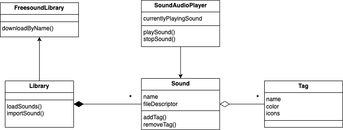
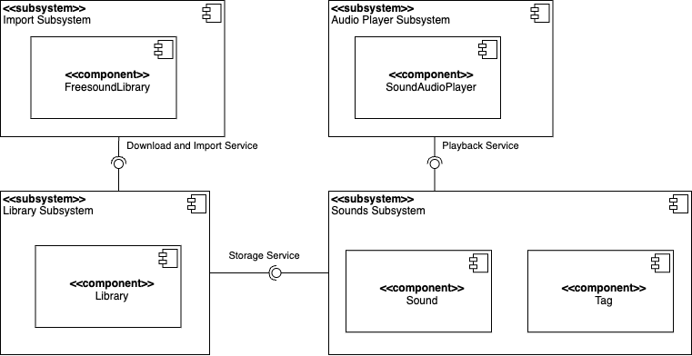

# Intro Course Project App of Andreas Urlberger for the iPraktikum

To pass the intro course, you need to create your own unique iOS app (based on SwiftUI).

There are no requirements regarding the functions of your app, so you can get creative.
However, we provide you with Non-Functional Requirements (NFR) that your app needs to fulfill.

After each day of learning new Swift and SwiftUI concepts, these NFRs may change, or new NFRs get added.

## Submission procedure

You get a **personal repository** on Gitlab to work on your app.

Once you implemented a new feature into your app, you need to create a Merge Request (MR - Sometimes we will also reference these as "Pull Requests"(PR)) to merge your changes from the feature branch into your main branch.

Your tutor will review your changes and either request changes or approves the MR.

If your MR got approved, you also need to merge it!

### Deadline: **15.10.2024 23:59**

Until the deadline all of your PRs **need to be merged** and your final app **needs to fulfill** all of the requested NFRs!

---

## Problem Statement (max. 500 words)
Sometimes we are missing the right words to say, which leaves us unable to express ourselves properly. To overcome this issue, I need an app that features a quick and easy way to find just the perfect short sound clip that matches my mood.
The app should provide a decent number of sounds out of the box, but also allow me to add new sounds. The import of new sounds should be possible for local files that I have on my phone but also for files from online sources like Freesound.org. The online import is important because it can be quite cumbersome to navigate these sound websites on a small phone screen. Being able to directly import these sound without having to download and locate them first, makes my life much easier.
Since my sound library will grow over time, I also need a way to categorize them into groups. These categories should easily spotable when I open the app and I want to be able to filter them such that I only see sounds of certain categories to make it easier to find the right ones.
And lastely, these soundboard apps or websites can be dull and boring, the app should, therefore, be a bit more engaging and visually appealing when I play a sound.

## Requirements

The user should be able to:
- Play sounds simply by tapping on them
- Categorise sounds using tags
- Add a color to each tag to make the sounds pop out
- Find the right sound easily by filtering the shown sounds by their tags
- Import sound files from the file system
- Import sound files from Freesound.org

## Analysis

## System Design

## Product Backlog

| Done | Task | Priority |
| ------ | ------ | -------- |
| [x] | Implement basic models for sounds, tags, view model, etc. | 1 |
| [x] | Implement logic for loading sounds from the app bundle. | 1 |
| [x] | Create overview (grid layout) that displays all sounds. | 1 |
| [x] | Color the sounds to reflect their attached tags. | 2 |
| [x] | Add a tag selection bar that can be clicked to select and deselect tags. If non of the tags of a sound are selected, then hide this sound. | 2 |
| [x] | Implement audio player to play sounds when tapped. | 1 |
| [x] | Add import of new local sounds. | 2 |
| [x] | Add download of new sounds from freesound.org. | 2 |
| [x] | Allow selection of tags when importing a new sound. | 3 |
| [x] | Let there be confetti when playing a sound (confetti should reflect the tags). | 1 |
| [x] | Add toggle to disable confetti. | 2 |